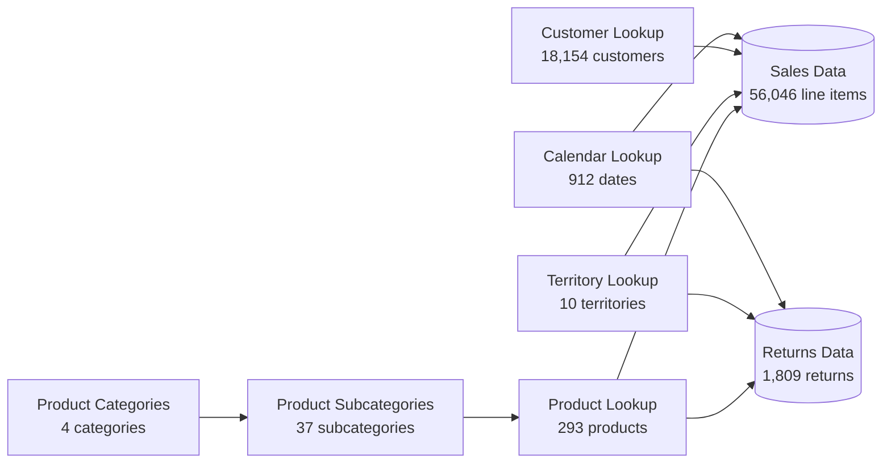

<p align="center">
  
</p>

<h1 align="center">AdventureWorks Sales &amp; Customer Analytics</h1>
<p align="center"><b>An end-to-end Power BI project — from raw CSVs to an 8-page, AI-augmented business intelligence report.</b></p>

<p align="center">
  
  
  
  
</p>

## Table of Contents

- [Overview](#overview)
- [The Brief](#the-brief)
- [Key Metrics](#key-metrics)
- [Key Insights](#key-insights)
- [Repository Structure](#repository-structure)
- [Data Sources](#data-sources)
- [Data Model](#data-model)
- [Report Walkthrough](#report-walkthrough)
- [Key DAX Measures](#key-dax-measures)
- [Navigation and Interactivity](#navigation-and-interactivity)
- [Skills and Techniques Demonstrated](#skills-and-techniques-demonstrated)
- [Development Journey](#development-journey)
- [Getting Started](#getting-started)
- [Screenshots](#screenshots)
- [Data Source and Attribution](#data-source-and-attribution)
- [License](#license)

## Overview

This repository contains a complete Power BI business intelligence project built around **AdventureWorks Cycles**, a fictional global manufacturer of bikes, components, clothing, and accessories. It follows the full BI workflow end to end — cleaning raw exports in Power Query, building a star-schema data model, writing DAX measures, designing an 8-page interactive report, and layering in Power BI's AI visuals (Q&A, Decomposition Tree, Key Influencers).

The raw data and project brief come from Maven Analytics' *Microsoft Power BI Desktop for Business Intelligence* course (see [Data Source and Attribution](#data-source-and-attribution)); the data model, measures, and report design in this repo reflect my own work through that project.

## The Brief

AdventureWorks' leadership needs a single source of truth for the business: sales and profit KPIs, regional performance, product-level trends, and its highest-value customers — starting from nothing but a folder of disconnected CSVs covering transactions, returns, products, customers, and sales territories. This report plays the role of that solution: a self-service dashboard built for three audiences in one file — executives who want the headline numbers, regional and product managers who need to slice performance, and analysts who want to drill into the "why" behind the numbers.

## Key Metrics

*Calculated directly from the raw CSVs in [`Raw Data/`](<Raw%20Data>).*

| Metric | Value |
|---|---|
| Total Revenue | **$24.9M** |
| Total Profit | **$10.5M** (42.0% margin) |
| Distinct Orders | 25,164 |
| Units Sold | 84,174 |
| Return Rate | 2.17% (1,828 units returned) |
| Customers with ≥ 1 order | 17,416 of 18,154 profiled |
| Markets | 6 countries · 3 continents |
| Date Range | Jan 1, 2020 – Jun 30, 2022 |

> The finished report may label a couple of these slightly differently (e.g. "orders" as line items vs. distinct order numbers) — the figures above describe exactly what they say, computed straight from the source files.

## Key Insights

- **Bikes drive almost all the revenue.** Bikes generated ~95% of total revenue ($23.6M of $24.9M) from just 13,929 units, while Accessories moved over 4× the volume (57,809 units) at a much lower price point — a classic high-ticket/low-volume vs. low-ticket/high-volume split.
- **Australia punches above its weight.** Australia ($7.42M) very nearly matches the entire United States ($7.94M) in revenue, despite the U.S. being split across five separate sales territories — Australia is a disproportionately strong single market.
- **Growth is accelerating.** The 2022 export only covers January–June, yet H1 2022 revenue ($9.19M) is already within 2% of *all of* 2021 ($9.32M).
- **The customer file is highly activated.** 96% of profiled customers (17,416 of 18,154) have placed at least one order.
- **A data quirk worth flagging.** The "Components" product category (132 SKUs) has zero recorded transactions anywhere in the sales fact table — worth a footnote if this dataset is extended, since it means only 3 of the 4 product categories ever appear in sales-based visuals.

## Repository Structure

```
AdventureWorks-PowerBI-Dashboard/
├── README.md
├── images/                                          # logo + nav icons used in this README
│   ├── AdventureWorks_Logo.png
│   ├── Dashboard_Icon_Blue.png
│   ├── Map_Icon_Blue.png
│   ├── Product_Icon_Blue.png
│   ├── Customer_Icon_Blue.png
│   └── Filter_Icon_Blue.png
│
├── PBIX Files/
│   ├── AdventureWorks Report_FINAL.pbix              # ⭐ open this one
│   └── WIP Reports/                                  # build checkpoints — see Development Journey
│       ├── AdventureWorks Report_Power Query Complete.pbix
│       ├── AdventureWorks Report_Data Model Complete.pbix
│       ├── AdventureWorks Report_DAX Complete.pbix
│       ├── AdventureWorks Report_Visualization Complete.pbix
│       └── AdventureWorks Report_AI Complete.pbix
│
└── Raw Data/
    ├── AdventureWorks Calendar Lookup.csv
    ├── AdventureWorks Customer Lookup.csv
    ├── AdventureWorks Product Categories Lookup.csv
    ├── AdventureWorks Product Subcategories Lookup.csv
    ├── AdventureWorks Product Lookup.csv
    ├── AdventureWorks Territory Lookup.csv
    ├── AdventureWorks Returns Data.csv
    ├── AdventureWorks Sales Data 2020.csv
    ├── AdventureWorks Sales Data 2021.csv
    ├── AdventureWorks Sales Data 2022.csv
    └── Product Category Sales (Unpivot Demo).csv     # standalone Power Query practice file
```

> **Note:** the `images/` folder isn't in the original export — copy `AdventureWorks_Logo.png` and the five `*_Icon_Blue.png` files you already have into an `images/` folder at the repo root so they render above. The original raw-data export also includes a duplicate `Sales Data/` subfolder containing copies of the three yearly sales CSVs, used in the course to demonstrate Power Query's "combine files from folder" feature — both copies hold identical data, so it's safe to keep just one.

## Data Sources

| File | Rows | Grain | Role |
|---|---|---|---|
| Sales Data 2020 / 2021 / 2022 | 2,630 / 23,935 / 29,481 (56,046 combined) | 1 row per order line item | Fact |
| Returns Data | 1,809 | 1 row per return | Fact |
| Customer Lookup | 18,154 | 1 row per customer | Dimension |
| Product Lookup | 293 | 1 row per product | Dimension |
| Product Subcategories Lookup | 37 | 1 row per subcategory | Dimension |
| Product Categories Lookup | 4 | 1 row per category | Dimension |
| Territory Lookup | 10 | 1 row per sales territory | Dimension |
| Calendar Lookup | 912 | 1 row per day, Jan 2020 – Jun 2022 | Dimension |
| Product Category Sales (Unpivot Demo) | 20 | — | Practice file only, not part of the data model |

## Data Model

The model is a standard star schema: two fact tables — **Sales Data** (appended across the three yearly CSVs) and **Returns Data** — surrounded by six dimension tables, joined on the surrogate keys already present in the source files (`ProductKey`, `CustomerKey`, `TerritoryKey`, `OrderDate` / `ReturnDate`, `ProductSubcategoryKey`, `ProductCategoryKey`).



Four supporting tables sit outside the schema and hold no sales facts of their own:

| Table | Purpose |
|---|---|
| **Measure Table** | An empty "home" table that holds every DAX measure in the model, kept separate from any data table as a modeling best practice |
| **Rolling Calendar** | A disconnected date table used for trailing/rolling-period calculations |
| **Price Adjustment (%)** | A what-if parameter that drives the *Adjusted Profit* measure on the Product Detail page |
| **Product Metric Selection** / **Customer Metric Selection** | Field-parameter tables that let the report viewer swap which measure drives a chart, without needing a separate visual for each metric |

## Report Walkthrough

The final report spans **8 pages and roughly 90 visual elements**, reached through a fully custom navigation bar.

###  Executive Dashboard

The landing page — a single-screen summary built for leadership.

- Four headline KPI cards: **Total Revenue, Total Orders, Total Profit, Return Rate**
- A **Revenue Trending** line chart by month
- Three KPI visuals comparing the latest month to the prior month: Monthly Revenue, Monthly Orders, Monthly Returns
- An **Orders by Category** bar chart — hover any bar to trigger the Category Tooltip page (a mini KPI set plus a weekly order trend for that category)
- A top-products matrix (orders, revenue, and return rate by product)
- "Most Ordered Product Type" and "Most Returned Product Type" call-outs
- Slicers for **Year** and **Continent**

###  Regional Map

A geographic view of order volume by country, filtered by the same Continent slicer, for spotting regional patterns at a glance.

###  Product Detail

Product-level performance, reached via drillthrough from the Executive Dashboard or the nav bar.

- Three gauges: Monthly Orders / Revenue / Profit vs. target
- A **Profit Trending** line chart, including an *Adjusted Profit* series driven by the Price Adjustment (%) what-if slicer — model how a hypothetical price change would move profit
- A **Return Trending** area chart
- A Product Metric Selection parameter to swap which metric drives the page
- A "Selected Product" call-out and a back button to return to where you drilled through from

###  Customer Detail

Customer segmentation and top-account tracking.

- Total Customers and Average Revenue per Customer cards
- A customer-growth trend line
- Two donut charts: Orders by Income Level, Orders by Occupation
- A **Top 100 Customers** table (orders and revenue by customer)
- A Customer Metric Selection parameter plus a Year slicer
- A "Top Customer (by Revenue)" call-out

### AI-Powered Pages

Four supporting pages that showcase Power BI's built-in AI visuals:

- **Category Tooltip** — the hover pop-up wired to the Executive Dashboard's category chart
- **Q&A** — a natural-language query box for ad-hoc questions, backed by a supporting matrix
- **Decomposition Tree** — drills Total Orders down through Category → Subcategory → Product to find what's driving the number
- **Key Influencers** — two AI models: one on what's associated with a customer being a homeowner (income, education, marital status, occupation, parental status), and one on what's associated with a product's average retail price (cost, subcategory)

## Key DAX Measures

The Measure Table holds every calculation in the model. These are the ones directly wired into the report's visuals — there may be a few additional supporting measures not surfaced on a page.

**Core KPIs**

| Measure | What it does |
|---|---|
| Total Revenue | Revenue summed across all order line items |
| Total Profit | Total Revenue minus total cost |
| Total Orders | Order volume shown on the headline KPI cards |
| Total Returns | Returned units summed across the returns table |
| Return Rate | Total Returns ÷ Total Orders |
| Total Customers | Customers with at least one order |
| Average Revenue per Customer | Total Revenue ÷ Total Customers |

**Time Intelligence**

| Measure | What it does |
|---|---|
| Previous Month Revenue | Prior month's Total Revenue, for month-over-month comparison |
| Previous Month Orders | Prior month's Total Orders |
| Previous Month Returns | Prior month's Total Returns |

**Targets and What-If Analysis**

| Measure | What it does |
|---|---|
| Revenue Target / Order Target / Profit Target | Goal lines plotted against actuals on the Product Detail gauges |
| Adjusted Profit | Recalculates profit using the Price Adjustment (%) what-if parameter, for pricing-sensitivity analysis |

## Navigation and Interactivity

Rather than Power BI's default page tabs, the report uses a custom left-hand navigation bar built from action buttons and a two-tone icon set — plain white icons at rest, switching to the brand teal (`#20E2D7`) on hover and selection:

<p>
      
</p>

- **Dashboard / Map / Product / Customer** buttons jump straight to that page
- **Filter** button opens the report's filter pane
- A dedicated **reset** button clears every slicer back to its default
- A **back arrow** returns from a drillthrough page to wherever you came from
- Right-click any product or customer visual and choose **Drillthrough** to jump into Product Detail or Customer Detail, pre-filtered to that item
- Seven slicers across the report in total, including the two field-parameter slicers above and the Price Adjustment (%) what-if slicer

## Skills and Techniques Demonstrated

**Data Preparation — Power Query**
- Combined three years of sales exports (2020–2022) into a single fact table
- Cleaned and typed eight source tables; built calculated/conditional columns (e.g. income bands, a parent flag, a full-name column)
- Practiced unpivoting wide data using the standalone unpivot-demo file

**Data Modeling**
- Built a star schema — two fact tables around six dimension tables
- Managed relationships, cardinality, and cross-filter direction
- Added a dedicated Measure Table plus three disconnected parameter tables for what-if analysis and field-parameter switching

**DAX**
- 14+ measures spanning core KPIs, month-over-month time intelligence, and target/what-if calculations (see [Key DAX Measures](#key-dax-measures))

**Report Design and UX**
- An 8-page report with ~90 visual elements, a fully custom navigation system, bookmarks, tooltips, drillthrough, and field-parameter slicers
- Consistent branding using the AdventureWorks logo and a two-tone icon set

**AI-Augmented Analytics**
- Q&A natural-language querying, Decomposition Tree, and Key Influencers to surface drivers without manual pivoting

## Development Journey

The `WIP Reports/` folder captures a checkpoint at each stage of the BI workflow — useful if you want to see the process, not just the finished file.

| Checkpoint file | Stage | What's inside |
|---|---|---|
| `..._Power Query Complete.pbix` | 1. Data Preparation | Raw tables imported and cleaned in Power Query; report canvas still blank |
| `..._Data Model Complete.pbix` | 2. Data Modeling | Star-schema relationships built; report canvas still blank |
| `..._DAX Complete.pbix` | 3. DAX Measures | Measure Table and core calculations added; report canvas still blank |
| `..._Visualization Complete.pbix` | 4. Report Design | All 5 core pages built: Executive Dashboard, Map, Product Detail, Customer Detail, Category Tooltip |
| `..._AI Complete.pbix` | 5. AI Analytics | Q&A, Decomposition Tree, and Key Influencers pages added (8 pages total) |
| `AdventureWorks Report_FINAL.pbix` | 6. Final Polish | Finished, presentation-ready version — this is the one to open |

## Getting Started

**Requirements:** [Power BI Desktop](https://www.microsoft.com/en-us/power-platform/products/power-bi/downloads) (free, Windows only).

1. Clone or download this repository.
2. Open `PBIX Files/AdventureWorks Report_FINAL.pbix`.
3. The report's Power Query steps originally pointed at local CSV files, so on first open Power BI Desktop will likely flag the data sources as missing. Go to **Transform Data → Data Source Settings**, repoint the source to wherever you cloned `Raw Data/`, then **Refresh**.
4. Explore using the teal navigation bar on the left of each page, or right-click a product/customer visual to try **Drillthrough**.
5. To see the build process instead of the finished report, open any file in `PBIX Files/WIP Reports/` — see [Development Journey](#development-journey) for what each one captures.

## Screenshots

*Add your own exports here before publishing — a picture is worth a thousand DAX measures.*

1. Open each page in Power BI Desktop and use **File → Export → Export to PDF**, or **Alt + PrtScn** per page.
2. Save the images into `images/screenshots/` (e.g. `exec-dashboard.png`, `map.png`, `product-detail.png`, `customer-detail.png`).
3. Paste this once they're in place:

```markdown


```

## Data Source and Attribution

This project uses the **AdventureWorks** sample dataset — a fictional global bicycle manufacturer — originally published by Microsoft. The specific CSV extracts and project brief used to build this report come from Maven Analytics' [*Microsoft Power BI Desktop for Business Intelligence*](https://www.udemy.com/course/microsoft-power-bi-up-running-with-power-bi-desktop/) course, taught by Chris Dutton.

All company names, transactions, and customers in this dataset are fictional and used for educational purposes only.

## License

The **data** in `Raw Data/` is Microsoft's publicly available AdventureWorks sample dataset, distributed for training purposes via the Maven Analytics course above — it isn't mine to relicense. The **report, DAX measures, and this README** are shared here for portfolio and educational purposes; feel free to fork and adapt them for your own learning. If you'd like an explicit license on your own contributions, [MIT](https://choosealicense.com/licenses/mit/) is a common, permissive choice for this kind of learning-portfolio repo.

---

<p align="center">
<b><a href="#">Your Name</a></b> ·
<a href="#">LinkedIn</a> ·
<a href="#">Portfolio</a> ·
<a href="#">Email</a>
<br>
<sub>Built while working through Maven Analytics' Power BI Desktop for Business Intelligence course.</sub>
</p>
